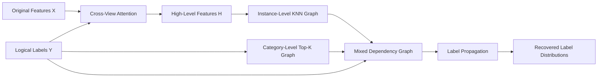

<div align="center">

# Label Enhancement via Cross-View Fusion and Mixed Graph Propagation

### CVMG · IJCAI-ECAI 2026

[](https://ijcai.org/)


**Mengjiao Kai · Chao Tan · Yanda Wang · Juanna Zhai · Kang Wu · Ningkang Peng · Yanhui Gu**

School of Computer and Electronic Information / School of Artificial Intelligence<br>
Nanjing Normal University

</div>

## Overview

Label Distribution Learning (LDL) represents the degree to which each label describes an instance, offering a richer learning target than conventional single-label or multi-label annotations. In practice, however, obtaining exact label distributions is costly. Label Enhancement (LE) addresses this challenge by recovering label distributions from readily available logical labels.

We propose **CVMG**, a label enhancement framework that fully exploits the complementary information contained in features and logical labels. CVMG first applies cross-attention to obtain enriched feature representations, then propagates label information over a mixed dependency graph that jointly models instance-level relationships and category-level correlations.

## Key contributions

- **Cross-view fusion.** A cross-attention mechanism integrates feature and logical-label views to produce more informative high-level representations.
- **Mixed dependency modeling.** An instance-level KNN graph and a category-level Top-K graph jointly capture relationships among samples and labels.
- **Unified label propagation.** Label information is propagated over both dependency structures to recover accurate label distributions.
- **Comprehensive evaluation.** Experiments on 13 real-world datasets demonstrate consistent improvements over six representative label enhancement methods.

## Framework



The framework contains three stages:

1. Fuse feature and logical-label views through multi-head cross-attention.
2. Construct an instance graph from enhanced representations and a category graph from label co-occurrence.
3. Perform iterative propagation on the mixed graph and normalize the output into label distributions.

## Experimental highlights

CVMG was compared with **LP, GLLE, LESC, LIB, LEVI, and ConLE** using six standard metrics. Lower values are preferred for the first four distance metrics, while higher values are preferred for the two similarity metrics.

| Metric | Chebyshev ↓ | Clark ↓ | Canberra ↓ | KL ↓ | Cosine ↑ | Intersection ↑ |
|:--|--:|--:|--:|--:|--:|--:|
| **CVMG average rank** | **1.38** | **1.00** | **1.08** | **1.27** | **1.35** | **1.00** |

### Evaluation at a glance

| Setting | Scale |
|:--|:--|
| Real-world datasets | **13** |
| Evaluation metrics | **6** |
| Compared methods | **6** |
| Main components validated by ablation | **2** |

The ablation study confirms that both cross-view fusion and mixed-graph propagation make meaningful contributions to label distribution recovery.

## Why CVMG works

Most existing label enhancement methods rely primarily on feature correlations and use logical labels only as supervision. CVMG instead treats features and logical labels as complementary views:

- feature similarity provides local relationships among instances;
- label co-occurrence reveals dependencies among categories; and
- cross-attention connects the two views before graph construction.

This combination produces more discriminative representations and enables label information to propagate through both sample and category structures.

## Citation

```bibtex
@inproceedings{kai2026cvmg,
  title     = {Label Enhancement via Cross-View Fusion and Mixed Graph Propagation},
  author    = {Kai, Mengjiao and Tan, Chao and Wang, Yanda and Zhai, Juanna and Wu, Kang and Peng, Ningkang and Gu, Yanhui},
  booktitle = {Proceedings of IJCAI-ECAI 2026},
  year      = {2026}
}
```

## Acknowledgments

This work was supported by the National Natural Science Foundation of China under Grants 62476135 and 62406145, and the Natural Science Foundation of the Higher Education Institutions of Jiangsu Province under Grant 24KJB520015.
